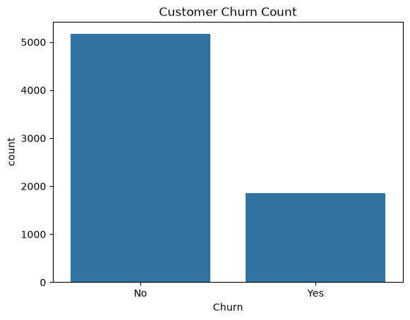
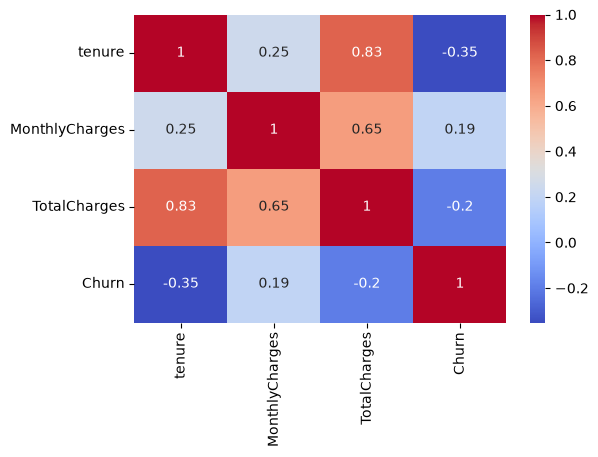
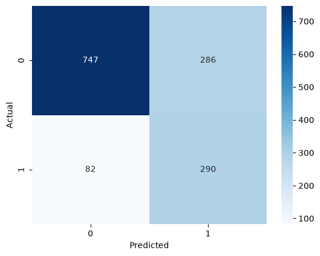

# Customer Churn Prediction

## Problem Statement
Customer churn — when a customer stops using a company's service — directly impacts revenue, and it's far cheaper to retain an existing customer than acquire a new one. This project builds a predictive model to identify customers at high risk of churning, so a telecom company can proactively target them with retention offers.

## Dataset
- **Name:** Telco Customer Churn
- **Source:** Kaggle
- **Link:** https://www.kaggle.com/datasets/blastchar/telco-customer-churn
- **Rows / Columns:** 7,043 rows, 21 columns

## Tools Used
- Python
- Pandas, NumPy
- Matplotlib, Seaborn
- Scikit-learn
- [Any other libraries you used, e.g. imbalanced-learn for handling class imbalance]

## Workflow
1. Data Collection
2. Data Cleaning (handling missing values in `TotalCharges`, encoding categorical variables)
3. Exploratory Data Analysis (EDA)
4. Feature Engineering (encoding, scaling, handling class imbalance)
5. Model Building (Logistic Regression)
6. Evaluation
7. Insights & Recommendations

## Results
- **Model:** Logistic Regression
- **Key Metric(s):** [e.g., Accuracy = 0.80, Precision = 0.65, Recall = 0.55, F1 = 0.60, AUC = 0.84]
- **Top Factors / Drivers:** [e.g., Contract type (month-to-month customers churn more), tenure (newer customers churn more), monthly charges (higher charges correlate with churn)]

## Screenshots

## Data Visualization

### Churn Count

### Correlation Heatmap

### Confusion Matrix

## Future Improvements
- Try a Random Forest or XGBoost model and compare performance
- Address class imbalance with SMOTE or class weighting
- Perform hyperparameter tuning (GridSearchCV / RandomizedSearchCV)
- Deploy the model as a simple web app (e.g., Streamlit or Flask)

## Author
Divyanshu Rai | https://www.linkedin.com/in/divyanshu-rai-313d2005
